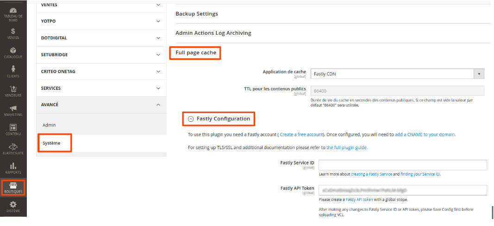
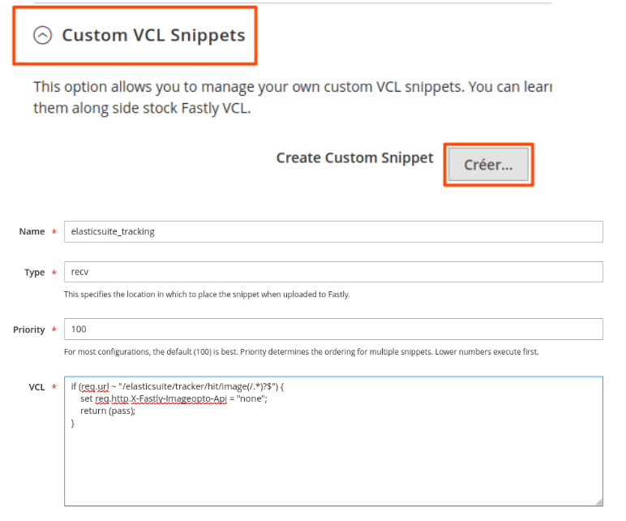

{: .no_toc }

<details open markdown="block">
  <summary>
    Table of contents
  </summary>
  {: .text-delta }
- TOC
{:toc}
</details>

## Requirements
Elasticsuite Open Source is required for any premium module.

Each module's composer requirements should install the correct version of Elasticsuite if that's not already done.

For now, the following versions of ElasticSuite Open Source are supported: 
 2.8.x (Magento 2.3.x < 2.3.5)
 2.9.x (Magento 2.3.x >= 2.3.5)
 2.10.x (Magento 2.4.x >= 2.4.1 && 2.4.x < 2.4.6)
 2.11.x (Magento 2.4.x >= 2.4.6)

## Composer configuration
Elasticsuite Premium is made of several private packages accessible only through authentication on the privately available Smile packagist. To do so, you need to configure your composer to provide your credentials. 
That’s exactly the same process as done by Magento with their Commerce version which is available only through a private repository.
Your credentials are unique and confidential, they will be sent to you once you purchased a license.

Declare the private repository in composer.json
Add the https://elasticsuite.repo.packagist.com/yourcustomername/ composer repository to composer's config.json (usually ~/.composer/config.json):

```json
{
    [...]
    "repositories": [
        [...],
        {
            "type": "composer",
            "url": "https://elasticsuite.repo.packagist.com/yourcustomername/" 
        }
    ],
    [...]
}
```

Declare the credentials in auth.json

Add the elasticsuite.repo.packagist.com credentials to your composer's auth.json (usually ~/.composer/auth.json) as an http-basic authentication

```json
{
    "http-basic": {
        [...],
        "repo.magento.com": {
            [...]
        },
        "elasticsuite.repo.packagist.com": {
            "username": "<your unique username provided with the license>",
            "password": "<your associated password>" 
        }
    }
}
```

## Installation
On Magento 2.4.5, the Elasticsuite composer requirement is: @composer require smile/elasticsuite ~2.10.0@ .

The Elasticsuite premium modules follow the same syntax. For instance @composer require smile/module-elasticsuite-facet-recommender ~2.10.0@ for the facet recommender module.

You just need to require the same version that you already have for the Elasticsuite Open Source version.

### 1a. Install the modules : On Magento Open Source

For Magento Open Source edition, you will not be able to install the modules smile/module-elasticsuite-catalog-optimizer-customer-segment and smile/module-elasticsuite-ab-campaign-customer-segment because they requires the magento/module-customer-segment which is only included in Adobe Commerce.

```
composer --ignore-platform-reqs require \
smile/module-elasticsuite-ab-campaign ~2.11.0 \
smile/module-elasticsuite-behavioral-autocomplete ~2.11.0 \
smile/module-elasticsuite-behavioral-data ~2.11.0 \
smile/module-elasticsuite-behavioral-optimizer ~2.11.0 \
smile/module-elasticsuite-configurable-product ~2.11.0 \
smile/module-elasticsuite-explain ~2.11.0 \
smile/module-elasticsuite-facet-recommender ~2.11.0 \
smile/module-elasticsuite-instant-search ~2.11.0 \
smile/module-elasticsuite-layered-navigation ~2.11.0 \
smile/module-elasticsuite-merchandiser ~2.11.0 \
smile/module-elasticsuite-recommender ~2.11.0 \
smile/module-elasticsuite-recommender-graph-ql ~2.11.0 \
smile/module-elasticsuite-term-recommender ~2.11.0 \
smile/module-elasticsuite-virtual-attribute ~2.11.0
```

### 1b. Install the modules : On Adobe Commerce

```
composer --ignore-platform-reqs require \
smile/module-elasticsuite-ab-campaign ~2.11.0 \
smile/module-elasticsuite-ab-campaign-customer-segment ~2.11.0 \
smile/module-elasticsuite-behavioral-autocomplete ~2.11.0 \
smile/module-elasticsuite-behavioral-data ~2.11.0 \
smile/module-elasticsuite-behavioral-optimizer ~2.11.0 \
smile/module-elasticsuite-catalog-optimizer-customer-segment ~2.11.0 \
smile/module-elasticsuite-configurable-product ~2.11.0 \
smile/module-elasticsuite-explain ~2.11.0 \
smile/module-elasticsuite-facet-recommender ~2.11.0 \
smile/module-elasticsuite-instant-search ~2.11.0 \
smile/module-elasticsuite-layered-navigation ~2.11.0 \
smile/module-elasticsuite-merchandiser ~2.11.0 \
smile/module-elasticsuite-recommender ~2.11.0 \
smile/module-elasticsuite-recommender-graph-ql ~2.11.0 \
smile/module-elasticsuite-term-recommender ~2.11.0 \
smile/module-elasticsuite-virtual-attribute ~2.11.0
```

Please note that in the eventuality of forgetting to install @smile/module-elasticsuite-behavioral-data@,it will be automatically installed since it is required by @smile/module-elasticsuite-behavioral-optimizer@'s composer.json.
Please also note that @smile/magento2-react@ will be automatically required and installed since required by @smile/module-elasticsuite-instant-search@. This module will add @package-magento-react.json@ in your project repository. You will need to merge the content of this file with your @package.json file@. If you don't have any pre-existing @package.json@ at the project root, you can rename the @package-magento-react.jso@ to @package.json@

### 2a. Enable all modules if needed : On Magento Open Source

```
php bin/magento module:enable Smile_ElasticsuiteBehavioralAutocomplete \
Smile_ElasticsuiteBehavioralData \
Smile_ElasticsuiteBehavioralOptimizer \
Smile_ElasticsuiteFacetRecommender \
Smile_React \
Smile_ElasticsuiteInstantSearch \
Smile_ElasticsuiteRecommender \
Smile_ElasticsuiteRecommenderGraphQl \
Smile_ElasticsuiteVirtualAttribute \
Smile_ElasticsuiteExplain \
Smile_ElasticsuiteAbCampaign \
Smile_ElasticsuiteConfigurableProduct \
Smile_ElasticsuiteLayeredNavigation \
Smile_ElasticsuiteMerchandiser \
Smile_ElasticsuiteTermRecommender \
Smile_ElasticsuiteBeacon
```

### 2b. Enable all modules if needed : On Adobe Commerce

```
php bin/magento module:enable Smile_ElasticsuiteBehavioralAutocomplete \
Smile_ElasticsuiteBehavioralData \
Smile_ElasticsuiteBehavioralOptimizer \
Smile_ElasticsuiteCatalogOptimizerCustomerSegment \
Smile_ElasticsuiteFacetRecommender \
Smile_React \
Smile_ElasticsuiteInstantSearch \
Smile_ElasticsuiteRecommender \
Smile_ElasticsuiteRecommenderGraphQl \
Smile_ElasticsuiteVirtualAttribute \
Smile_ElasticsuiteExplain \
Smile_ElasticsuiteAbCampaign \
Smile_ElasticsuiteAbCampaignCustomerSegment \
Smile_ElasticsuiteConfigurableProduct \
Smile_ElasticsuiteLayeredNavigation \
Smile_ElasticsuiteMerchandiser \
Smile_ElasticsuiteTermRecommender \
Smile_ElasticsuiteBeacon
```

### 3. Run setup and reindex.

As usual after installing a Magento2 module, clean the cache and run @setup:upgrade@ (if in production mode, also run @setup:di:compile@ and @setup:static-content:deploy@).

You will also need to reindex the catalog with either:

```
bin/magento indexer:reindex (reindexing everything)
bin/magento indexer:reindex catalogsearch_fulltext (just to reindex catalog products)
```

### 4. Register your client id
Elasticsuite premium packages are embedded with a “beacon” feature that will periodically trigger pings to the Smile information system. This is mandatory to configure it properly by putting the correct client id into it, so that Smile remains able to identify which website is using the solution.

To configure this, you have to go to **Stores > Configuration > Elasticsuite > Elasticsuite Premium Beacon** and fill the Client ID field with the value that has been provided to you.

If we provided environment specific client ids, you will have to configure each environment with the proper client Id.

## Instant Search

The @smile/module-elasticsuite-instant-search@ requires @smile/magento2-react@ to provide a React based autocomplete search feature: it will be automatically required and installed when requiring @smile/module-elasticsuite-instant-search@.

@smile/magento2-react@ requires yarn to be installed on the deployment frontend servers, in order to build and package the React JavaScript sources.

See the instructions below for "Installing yarn".

### Installing Yarn
The latest yarn version must be installed by following https://classic.yarnpkg.com/en/docs/install
E.g. on a debian based environment, the following steps are

```
curl -sS https://dl.yarnpkg.com/debian/pubkey.gpg | sudo apt-key add -
echo "deb https://dl.yarnpkg.com/debian/ stable main" | sudo tee /etc/apt/sources.list.d/yarn.list
sudo apt update && sudo apt install yarn
```

### Building React sources
In your development environment, you should have a package.json and webpack.config.js files that are copied to the Magento root directory when installing the smile/magento2-react module.
If that’s not the case, copy the vendor/smile/magento2-react/package.json and vendor/smile/magento2-react/webpack.config.js to your magento root directory.
On your dev environment, we recommend adding webpack.config.js (and package.json if not already versioned) to your  .gitgnore.

To build the React sources, run the following commands  in your magento directory with the appropriate user (the same that owns the Magento sources, usually www-data):

```
sudo -u www-data yarn install
sudo -u www-data mkdir -p var/tmp && sudo -u www-data yarn build
```

In your development environment, you can also replace the yarn build by yarn dev .
Please note that the user must have write permissions on his home directory.

### Embed the React sources in delivery packages
Depending on how you are building packages to be delivered on staging, pre-production and production environments, you will need to tailor your strategy to either build the React sources locally before packaging, or delegate this task to the target environment at the end of the delivery process.

We recommend doing it locally (or through a CI/CD pipeline) before packaging the application (like Magento does with the di:compile and static-content:deploy step) rather than letting the target servers to proceed.

Building React sources with Magento Cloud
If your project is hosted on magento cloud, you need some specific configuration in order to make the instant search working.
In your project directory, you should have a .magento.app.yaml file with the definition of the hook "build" in it :

```yaml
hoks:
   build: |
    	set -e
    	composer install
    	php ./vendor/bin/ece-tools run scenario/build/generate.xml
    	php ./vendor/bin/ece-tools run scenario/build/transfer.xml
 ```

You need to add the installation of yarn and the building of the react app in this step:

```yaml
hooks:
   build: |
        set -e
        npm install --global yarn
        composer install
        php ./vendor/bin/ece-tools run scenario/build/generate.xml
        mkdir -p var/tmp
        yarn install
        yarn build
        php ./vendor/bin/ece-tools run scenario/build/transfer.xml
```

Then you need to indicate to Magento not to update the package.json file during the composer install process of the deployment. In the composer.json file of your project, add these lines :

```json
{
    ...
    "extra": {
        ...
        "magento-deploy-ignore": {
            "smile/magento2-react": [
                "/package.json"
            ]
        },
        ...
    }
    ....
}
```


## Tracking
### Integration with Magento Cloud
You will need to ask magento to add the following configuration to elasticsearch (or opensearch) :
in  /etc/opensearch/opensearch.yml add :

```
script.allowed_types: inline
script.allowed_contexts: search,update,aggs
```

### Integration with Magento Cloud and/or Fastly

If you are using Magento Cloud. or simply using Fastly, it's likely that it will block the tracker request.

To fix this you can either add a custom VCL or set the Tracker to use the REST Api.

#### The custom VCL

You should reach the Fastly configuration : 



And then add this VCL in the "recv" section : 

```
if (req.url ~ "/elasticsuite/tracker/hit/image(/.*)?$") {
	set req.http.X-Fastly-Imageopto-Api = "none";
	return (pass);
}
```



#### Use the REST Api

You can go to **Stores > Configuration > Elasticsuite > Tracking** and set **Use the API to collect data** to **Yes**

## Headless

If you're running an headless website, please check the two following pages : 
